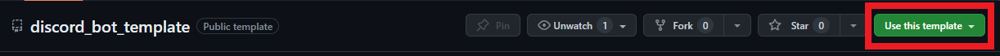

# Discord Bot Template

<!-- TABLE OF CONTENTS -->
<details>
    <summary>Table of Contents</summary>
    <ol>
        <li>
            <a href="#important-information">Important Information</a>
        </li>
        <li>
            <a href="#getting-started">Getting Started</a>
        </li>
    </ol>
</details>

<!-- Important Information -->
##  Important Information
- This template uses code that is compatible with Python 3.8+
- This template uses the [discord.py](https://discordpy.readthedocs.io/) library
- I use [fly.io](https://fly.io/) to host all of my bots as their free tier is incredible for smaller projects


<!-- Getting Started -->
## Getting Started

---
Create your GitHub repo using this template:


Once you've created your new repo, clone it to your machine, and now you can create your virtual environment:
```commandline
python -m venv venv
```
---
Be sure to source your newly created **venv**:

**_cmd_**
```commandline
venv/Scripts/activate.bat
```

**_Powershell_**
```commandline
venv\Scripts\Activate.ps1
```

**_bash_**
```commandline
source venv/bin/activate
```
---
Next, you need to install the necessary dependencies:

```commandline
pip install -r requirements.txt
```

### Set up your bot for Discord
- Create your bot on the [Discord Developer Portal](https://discord.com/developers/applications)
- Copy **TOKEN** in the Bot tab
- Create a _**.env**_ file in your root directory and paste your token:
  - ``DISCORD_TOKEN = <token from portal>``

### You should now be good to go for developing your new discord bot!

---

If you run into any issues with the template, please leave an issue in this repo, and I'll try to get to it as soon as possible.

---
# ENJOY!